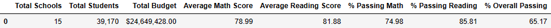
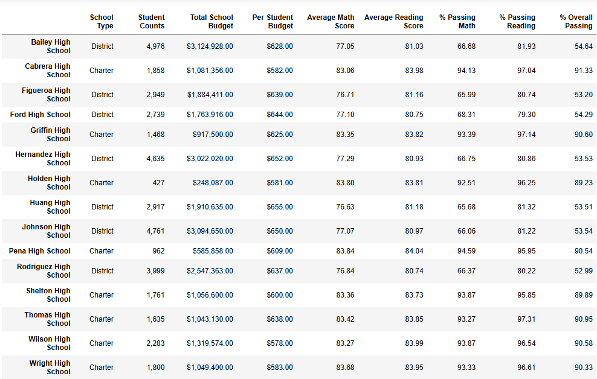
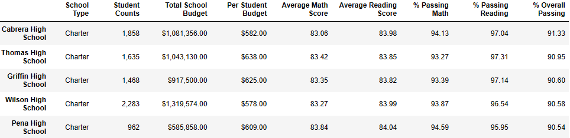
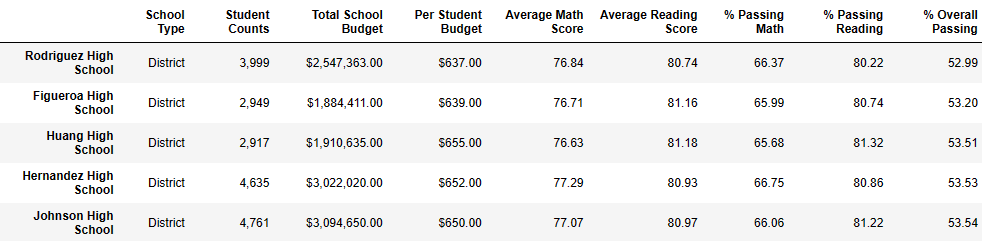
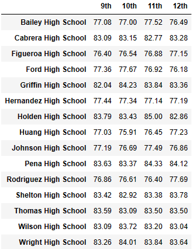
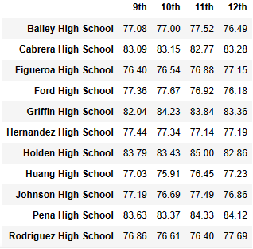
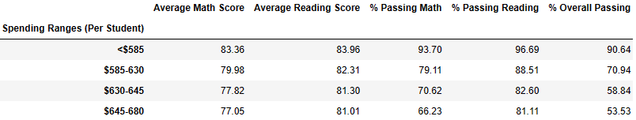
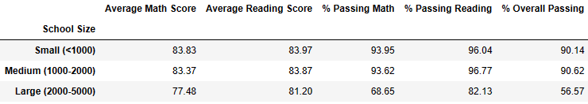
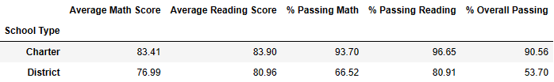
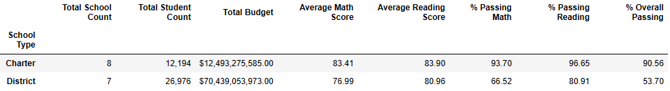

## PyCity Schools

The following are the visualizations resulting from a professional analysis of district-wide standardized test results for the PyCity School system using student math and reading scores as well as budgetary data.  The following are the school system requirements, along with the supportive visualizations.

## Author

Ashley Sligh

## Limitations

When viewing the .ipynb file in GitHub, the columns in the Visualizations will be shifted. It is recommended to download the project to a local machine and launch jupyter notebook from the directory via a Bash session.

## Programming Language/Tools Applied

Python, Jupyter Notebook, CSV

### District Summary

* High level snapshot (in table form) of the district's key metrics, including:
  * Total Schools
  * Total Students
  * Total Budget
  * Average Math Score
  * Average Reading Score
  * % Passing Math (The percentage of students that passed math.)
  * % Passing Reading (The percentage of students that passed reading.)
  * % Overall Passing (The percentage of students that passed math **and** reading.)

### School Summary

* Overview table that summarizes key metrics about each school, including:
  * School Name
  * School Type
  * Total Students
  * Total School Budget
  * Per Student Budget
  * Average Math Score
  * Average Reading Score
  * % Passing Math (The percentage of students that passed math.)
  * % Passing Reading (The percentage of students that passed reading.)
  * % Overall Passing (The percentage of students that passed math **and** reading.)

### Top Performing Schools (By % Overall Passing)

* Table that highlights the top 5 performing schools based on % Overall Passing including the following data points:
  * School Name
  * School Type
  * Total Students
  * Total School Budget
  * Per Student Budget
  * Average Math Score
  * Average Reading Score
  * % Passing Math (The percentage of students that passed math.)
  * % Passing Reading (The percentage of students that passed reading.)
  * % Overall Passing (The percentage of students that passed math **and** reading.)

### Bottom Performing Schools (By % Overall Passing)

* Table that highlights the bottom 5 performing schools based on % Overall Passing

### Math Scores by Grade

* Table that lists the average Math Score for students of each grade level (9th, 10th, 11th, 12th) at each school.

### Reading Scores by Grade

* Tablethat lists the average Reading Score for students of each grade level (9th, 10th, 11th, 12th) at each school.

### Scores by School Spending

* Table that breaks down school performances based on average Spending Ranges (Per Student). Use 4 reasonable bins to group school spending. Include in the table each of the following:
  * Average Math Score
  * Average Reading Score
  * % Passing Math (The percentage of students that passed math.)
  * % Passing Reading (The percentage of students that passed reading.)
  * % Overall Passing (The percentage of students that passed math **and** reading.)

### Scores by School Size

* Analysis of scores by school size based on a reasonable approximation (Small, Medium, Large).

### Scores by School Type

* Analysis of scores by school type (Charter vs. District).

## Findings

#### Conlusion 1: 
(See Above) Charter schools have better math and reading scores than district schools. Most notably, the overall passing rate for Charter Schools is far better at 90.56% than the rate of 53.70% for District Schools. The above visualization expands on previous analysis by the addition of "School Count", "Student Count", and "Total Budget" columns to gain further insight into the base-line data. As presented above, the budget for Charter Schools is around 12 mil compared to a District School budget of around 75.0 mil yet test scores are lower. There appears to be an underlying issue that money alone cannot fix which leads to consideration #2...

#### Conlusion 2: 
By analyzing the data in the columns "Total School Count" and "Total Student Count", one can observe that test scores go down as school size goes up. One may conclude that school size and test performance are inversely correlated. The number of students in the District school system stands at nearly 27,000 while the students in the charter system stands at a little over 12,000. Another interesting finding is that there is 1 less District School than Charter Schools. The issue potential overcrowding becomes apparent. In conclusion, because there are significantly more students in the District School system and 1 fewer school, test performance is diminished. The addition of extra budgetary monies cannot alleviate the spacing / class size issue. The solution is to build more District Schools in order to increase the student-teacher ratio.

